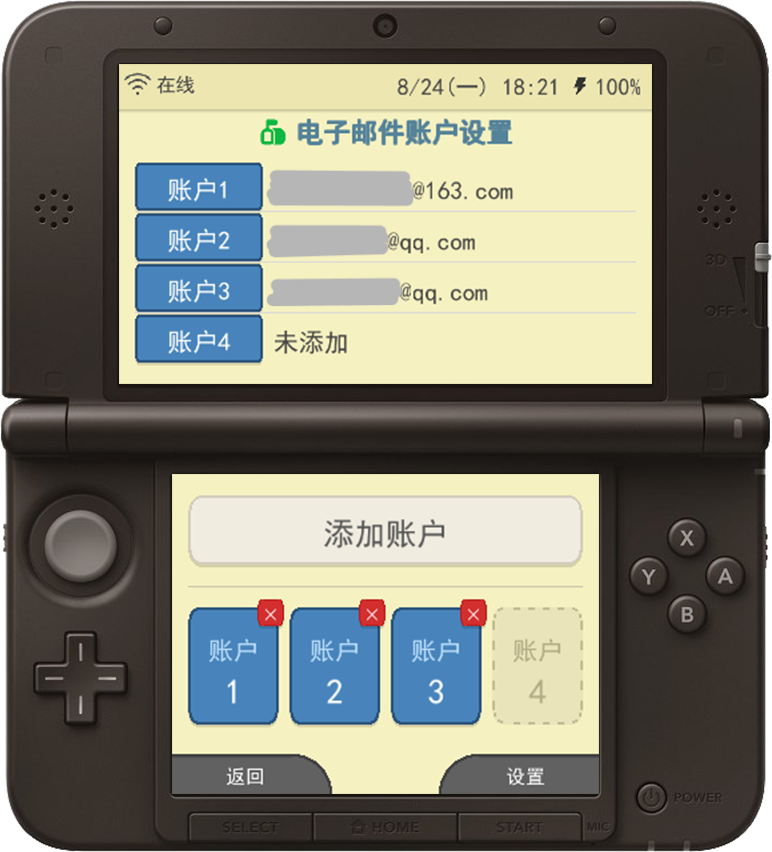
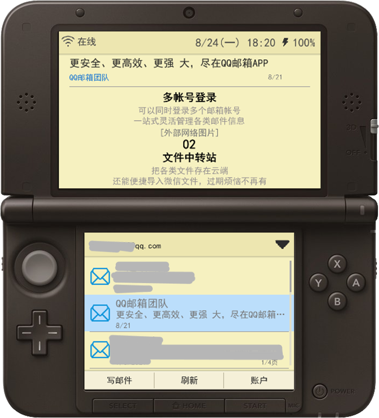
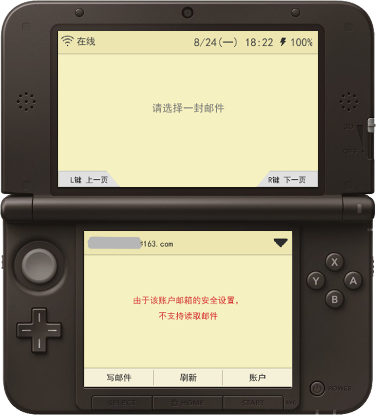
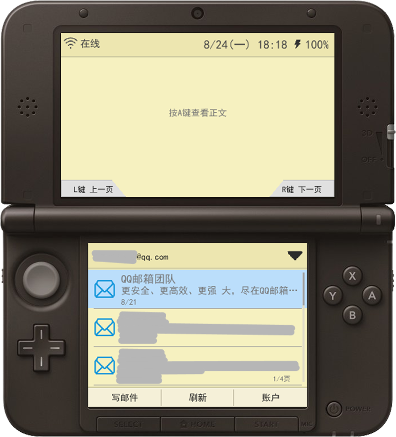
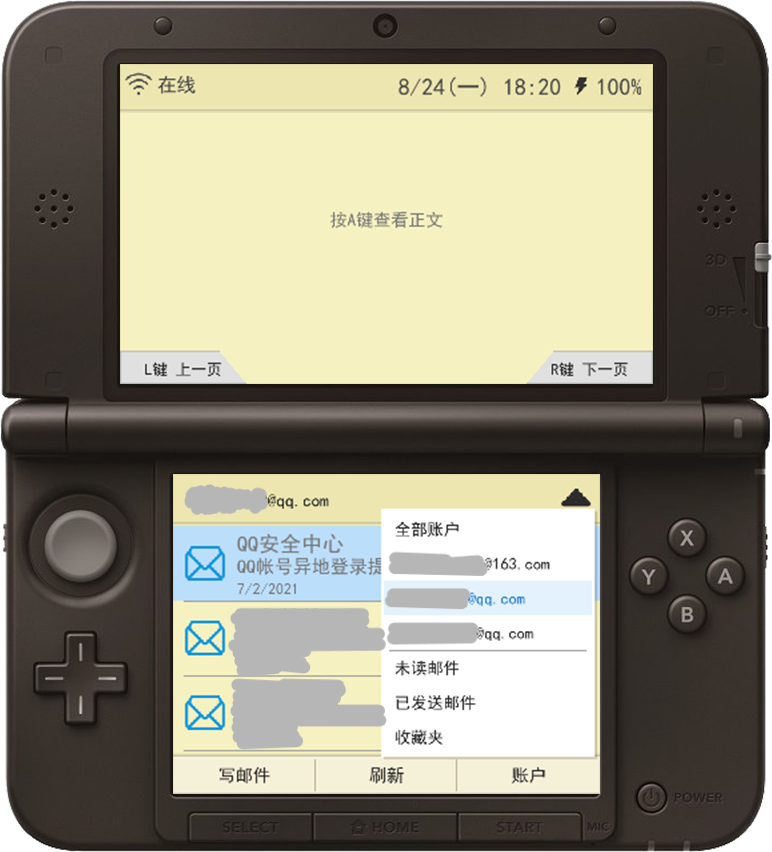

# Mail3DS —— 3DS 电子邮箱客户端

**v1.1.0** ｜ 作者：Wheat

一个运行在装有自制系统（CFW）的任天堂 3DS 上的第三方电子邮件客户端，使用 libctru / Citro2D / libcurl 用 C 语言编写。
在 2011 年的掌机上收发真实邮件：多账户管理、IMAP 收件、分页列表、中文邮件解码、本地缓存、离线浏览。

> **非官方项目。** 与腾讯（QQ 邮箱）、网易（163/126 邮箱）、Outlook、Gmail 等任何邮件服务商均无关联，未获其授权或认可。
>
> **与任天堂（Nintendo）亦无任何关联。**「Nintendo 3DS」是任天堂的商标。本程序是运行在自制系统上的第三方软件，不含任何任天堂的代码、密钥或资源。
>
> 登录邮箱请使用**授权码 / 应用专用密码**，而非常用登录密码；账户凭据只保存在本机 SD 卡，不会上传到任何第三方服务器。使用第三方客户端存在账号被风控的可能，风险自负。

```
┌───────────────────────────────────┐
│                                   │ 
│                                   │ 
│     上屏 400×240（不支持触摸）     │ 
│    状态栏 + 邮件正文 / 列表提示    │ 
│                                   │ 
│                                   │ 
└───┬───────────────────────────┬───┘
    │                           │ 
    │                           │ 
    │ 下屏 320×240（电阻触摸屏） │  
    │  邮件列表/按钮/设置/软键盘 │
    │                           │
    │                           │ 
    └───────────────────────────┘
```

> **关于这个项目**：作者本人并不懂 C 语言 / 3DS 开发，本项目是在 **豆包 AI** 的协助下，从界面设计、功能逻辑、网络协议到打包排错，全程通过与 AI 对话一步步完成的。把它开源出来，既是记录一个「外行 + AI」把想法做成能在真机上跑起来的软件的过程，也希望给同样不懂代码、但想做点小东西的人一点参考。代码中如有不成熟之处，欢迎 Issue / PR 指正。

---

## 截图

| | |
|---|---|
|  |  |
| 账户管理（最多 4 个账户） | 上屏正文 + 下屏列表 |
|  |  |
| 受限邮箱红字提示 | 选中邮件，按 A 查看正文 |
|  | |
| 文件夹 / 账户筛选下拉 | |

---

## 功能一览

| 功能 | 状态 | 说明 |
|---|---|---|
| 多账户管理 | ✅ | 最多保存 4 个邮箱账户，可随时切换 / 删除 |
| 添加账户校验 | ✅ | 邮箱格式校验、重复账户检测；保存前实测 IMAP + SMTP 登录，连通才保存并跳转 |
| IMAP 收件 | ✅ | 经 libcurl 走 IMAPS（SSL/TLS）拉取邮件 |
| SMTP 发件 | ⚠️ | 已完成连接 / 登录验证；撰写发送在后续版本开放 |
| QQ 邮箱适配 | ✅ | 针对 QQ 邮箱做了重点优化，列表加载与缓存读取更快 |
| 其他邮箱 | ⚠️ | 163 / 126 等网易系因强制 IMAP ID 上报与风控，第三方可能读不到邮件；读不到时列表以红字提示，不影响其他账户 |
| 分页加载 | ✅ | 按「每页邮件数」分页，L / R 肩键翻页，可设 7 / 10 / 15 / 20 封每页 |
| 邮件列表条目 | ✅ | 按优先级展示 发件人 > 主题 > 日期 > 正文预览 > 附件；未读 / 已读不同信封图标，未读带红点 |
| 智能时间显示 | ✅ | 当天显示 `HH:MM`，同年显示 `M/D`，跨年显示 `M/D/YYYY` |
| 排序 | ✅ | 按 IMAP UID 从大到小（最新在最上） |
| 触摸顺滑滚动 | ✅ | 整列表区域可触摸无级滑动，边缘邮件可半显 |
| 正文懒加载 | ✅ | 列表只缓存邮件头；选中后按 A（或再次点按）才下载、解析、缓存正文 |
| 正文阅读模式 | ✅ | 上屏显示正文，十字键 / 摇杆上下滚动；B 退出阅读 |
| MIME 解析 | ✅ | 支持 multipart、text/plain、text/html；解码 Base64 / Quoted-Printable |
| 中文解码 | ✅ | 解码 `=?GBK?B?…?=` / `=?UTF-8?Q?…?=` 等编码头，经 iconv 转码，主题 / 发件人 / 正文中文正常显示 |
| 内嵌 / 外链图片 | ⚠️ | CID 内嵌图片与 http 外链图片以 `[图片]` / `[外部链接图片]` 占位，不自动下载外链，避免追踪与证书问题 |
| 本地缓存 | ✅ | 邮件头与正文分离缓存到 SD 卡，已缓存页面秒开、不重复联网 |
| 设置持久化 | ✅ | 每页邮件数、通知、自动检查间隔、清除缓存等设置写入 SD，重启保留 |
| 自动检查新邮件 | ✅ | 可配置检查间隔（默认 15 分钟）；列表刷新按钮手动检测 |
| 清除缓存 | ✅ | 显示缓存占用（KB / MB），可一键清除并重新加载 |
| 状态栏 | ✅ | Wi-Fi 连接状态、时间、电池电量 |
| 中文软键盘 | ✅ | 下屏自带触摸键盘，用于输入邮箱地址与授权码 |
| 撰写 / 发送邮件 | 🚧 | 本版本「写邮件」提示「还在开发中」，发送功能将在后续版本开放 |

---

## 硬件与系统要求

**必需**

- 3DS / 2DS / New 3DS / New 2DS 系列主机，已安装自制系统（Luma3DS + Homebrew Launcher）
  - 破解教程：<https://3ds.hacks.guide>（有中文版）
- 可用的 Wi-Fi 网络
- 一个已开启 **IMAP/SMTP 服务**并取得**授权码**的邮箱账户

**关于授权码（重要）**

国内邮箱几乎都不能用网页登录密码登录第三方客户端，需要单独生成授权码：

- **QQ 邮箱**：设置 → 账号 → 开启 IMAP/SMTP 服务，按提示用手机发短信获取授权码
- **163 / 126 邮箱**：设置 → POP3/SMTP/IMAP → 开启 IMAP，同时设置客户端授权码
- Outlook / Gmail：需开启双重验证后创建「应用专用密码」；Gmail 在国内网络下 3DS 难以连通

---

## 安装使用

### 方式一：Homebrew Launcher（.3dsx）

把 `Mail3DS.3dsx` 拷到 SD 卡 `/3ds/` 目录（建议建子目录 `/3ds/Mail3DS/`），中文字库已打包进程序内置 RomFS，无需额外文件。在 Homebrew Launcher 中启动即可。

### 方式二：安装版（.cia）

用 FBI 安装 `Mail3DS.cia`，安装后直接出现在主菜单，无需每次进 HBL。

> CIA 为未签名自制程序，FBI 安装时如提示签名相关属正常现象（Luma3DS 会自动跳过签名校验）。

### 添加账户

1. 首次进入选择「添加账户」
2. 输入完整邮箱地址与**授权码**（不是登录密码）
3. 点「保存账户」，程序会先测试 IMAP / SMTP 连通性
4. 连接成功后自动进入邮件列表并拉取第一页邮件头

### 数据存放在哪里

所有数据只保存在本机 SD 卡 `sdmc:/3ds/Mail3DS/`：

```
sdmc:/3ds/Mail3DS/
├─ account_map.ini          # 账户序号 → 邮箱地址 映射
├─ accounts.dat             # 账户信息（含加密后的授权码）
├─ settings.ini             # 用户设置
└─ account_0/               # 每个账户一个目录
   ├─ header_cache/         # 邮件头（基础信息），<uid>.hdr
   └─ body_cache/           # 邮件正文，打开某封邮件时才生成
```

邮件头先缓存、正文按需缓存；删除程序目录即可清除全部本地数据。

---

## 操作说明

### 实体按键

| 按键 | 邮件列表 | 正文阅读 |
|---|---|---|
| 十字键 / 摇杆上下 | 选择邮件条目 | 上下滚动正文 |
| A | 加载并查看选中邮件正文 | — |
| B | 返回 / 关闭弹窗 | 退出阅读模式 |
| L / R | 上一页 / 下一页 | （阅读中翻页提示隐藏） |
| 触摸屏 | 点按选中、再次点按查看；列表区域可滑动滚动 | 滚动正文 |
| START | 退出程序 | 退出程序 |

### 列表交互

- **第一次点按**某条邮件 = 选中（与十字键上下选择等效）
- **再次点按**已选中的邮件 = 打开正文（与按 A 等效）
- 列表支持触摸顺滑滚动，上下边缘的邮件可以只显示一半
- 下屏底部：「刷新」「写邮件」「账户」，顶部可切换文件夹 / 账户筛选

---

## 已知问题与限制

- **网易系（163/126）可能读不到邮件。** 网易 IMAP 在登录后强制要求客户端发送 ID 指令上报身份，并有人机风控，未通过时即使登录成功也会返回空列表。程序会正常发起请求，确实读不到邮件时在列表显示红字「由于该账户邮箱的安全设置，不支持读取邮件」，并记住该状态、切换回来不再重复联网。**QQ 邮箱无此限制，体验最佳。**
- **HTML 邮件做了简化展示。** 复杂排版、样式与外链图片不会原样还原，图片以文字占位；优先保证文字内容可读。
- **撰写 / 发送邮件尚未开放**，当前版本点击「写邮件」会提示开发中。
- 邮件较多时首次同步需要一些时间，之后靠本地缓存秒开；翻到未缓存的页才会联网拉取。
- 仅做了 IMAP 收件读取，「已发送」「收藏夹」等服务器文件夹筛选在后续版本完善。

---

## 从源码编译

### 依赖

- [devkitPro](https://devkitpro.org) / devkitARM 工具链
- [libctru](https://github.com/devkitPro/libctru)、citro3d、citro2d
- portlibs：**curl、mbedTLS、zlib、libiconv**
- （打包 CIA）bannertool、makerom

MSYS2 环境下安装好 devkitPro 后，在项目根目录：

```bash
# 编译 3dsx
make

# 清理
make clean
```

链接库顺序为 `citro2d → citro3d → curl → mbedtls → mbedx509 → mbedcrypto → z → iconv → ctru → m`。

### 打包 CIA

本项目采用 makerom **直接从 ELF 构建**的方式（比 3dsx→cxi 反重定位更稳定），配置见 `cia_build/mail3ds_v2.rsf`，关键点：

- makerom 命令必须带 `-exefslogo -ignoresign`
- RSF 中需正确给出 GPU 的 `IORegisterMapping` / `MemoryMapping`、服务访问列表与模块 `Dependency`，否则安装后启动即黑屏
- RomFS 通过 `-DAPP_ROMFS=<romfs目录>` 传入

```bash
bash cia_build/build_v2.sh
```

> TitleID 的 UniqueId 只有 20 位（最大 `0xFFFFF`），自定义时注意不要超出范围。

---

## 致谢与许可

这个项目站在很多开源项目的肩膀上：

- [devkitPro](https://devkitpro.org)、[libctru](https://github.com/devkitPro/libctru)、[citro3d / citro2d](https://github.com/devkitPro/citro2d) —— 工具链与 2D/3D 图形库
- [curl](https://curl.se/) + [mbedTLS](https://www.trustedfirmware.org/projects/mbed-tls/) —— IMAP/SMTP over TLS
- [zlib](https://zlib.net/)、[libiconv](https://www.gnu.org/software/libiconv/) —— 压缩与字符集转码
- [Noto Sans CJK](https://github.com/notofonts/noto-cjk)（SIL OFL）—— 中文字体来源
- [3dbrew](https://www.3dbrew.org) —— 3DS 系统、NCCH / ExHeader / IMAP 相关文档
- 同为 3DS 第三方客户端的开源项目 [ClouDS-Music](https://github.com/cadl/ClouDS-Music) 与 [3Danmu](https://github.com/OakRoller/3Danmu) —— 它们成熟的 CIA 打包配置（RSF）帮助解决了启动黑屏与安装报错问题，特此致谢

本项目自有代码与文档采用 **MIT 许可证**（见 [LICENSE](LICENSE)）：允许任何人自由使用、修改、分发与商用，只需保留版权声明。注意：MIT 仅覆盖本项目自有代码；二进制中静态链接 / 打包的第三方组件（curl、mbedTLS、zlib、libiconv、Noto Sans CJK 等）各自遵循其原有开源许可证，分发构建产物前请一并遵守。

---

*本项目仅供个人学习与技术研究使用。请遵守各邮件服务商的用户协议，妥善保管授权码。*
